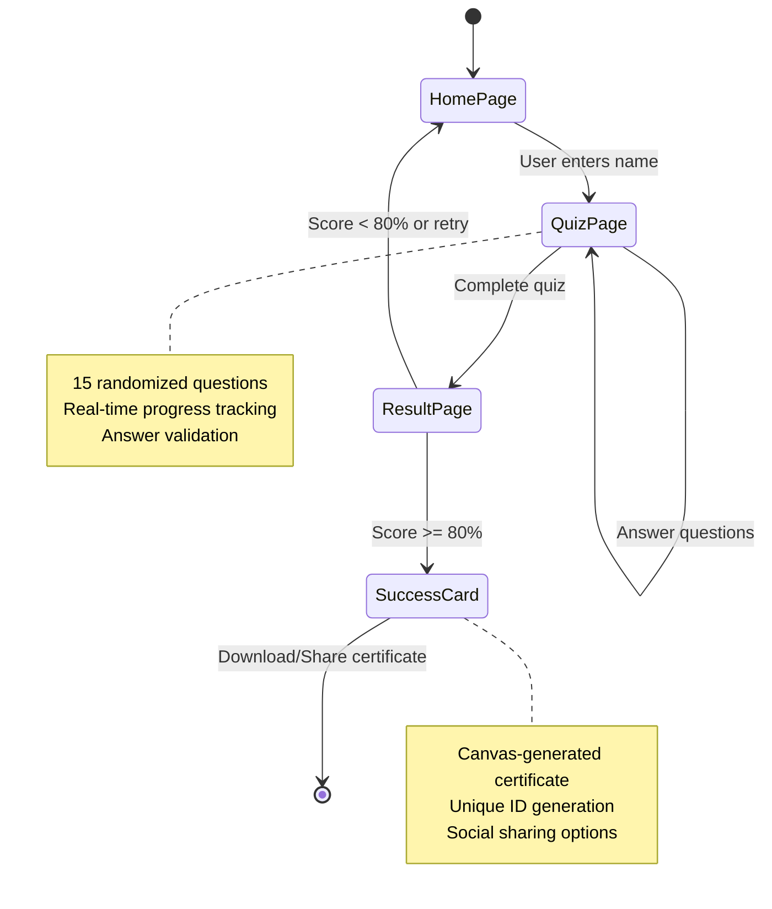
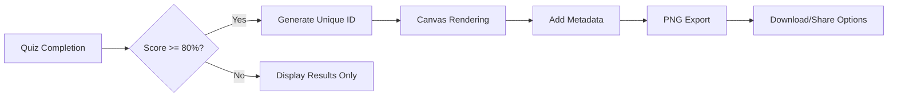

# BlockchainIQ - Master Blockchain & Crypto Knowledge

[](https://base.org/)
[](https://nextjs.org/)
[](https://reactjs.org/)
[](https://www.typescriptlang.org/)
[](https://tailwindcss.com/)
[](https://docs.farcaster.xyz/)
[](https://opensource.org/licenses/MIT)

**BlockchainIQ is a cutting-edge educational platform designed as a Farcaster and Base Mini App, empowering users to master blockchain and cryptocurrency knowledge through interactive quizzes. Built on Coinbase's Base Layer 2 network, it offers NFT-style certificates, real-time scoring, and seamless social sharing to validate and showcase blockchain expertise in the decentralized ecosystem.**

## 📋 Table of Contents

- [Overview](#-overview)
- [Key Features](#-key-features)
- [Architecture](#-architecture)
- [System Flow](#-system-flow)
- [Knowledge Domains](#-knowledge-domains)
- [Technology Stack](#-technology-stack)
- [Quick Start](#-quick-start)
- [User Guide](#-user-guide)
- [Mini App Integration](#-mini-app-integration)
- [Certificate System](#-certificate-system)
- [Development](#-development)
- [Deployment](#-deployment)
- [Contributing](#-contributing)
- [License](#-license)
- [Acknowledgments](#-acknowledgments)
- [Support](#-support)

## 🎯 Overview

BlockchainIQ revolutionizes blockchain education by providing an immersive, gamified learning experience. As a native Mini App within the Farcaster and Base ecosystems, it seamlessly integrates with social platforms and blockchain infrastructure to deliver:

- **Comprehensive Assessment**: 80+ expertly crafted questions covering blockchain fundamentals to advanced concepts
- **Dynamic Challenges**: Daily randomized 15-question quizzes ensuring fresh learning experiences
- **Credentialing System**: NFT-inspired certificates for high achievers (80%+ scores)
- **Social Integration**: Native sharing capabilities across Farcaster, Twitter, and other platforms
- **Mobile-First Design**: Optimized for seamless mobile and Mini App environments
- **Base Network Integration**: Leveraging Coinbase's Layer 2 for enhanced performance and user experience

The platform serves as both an educational tool and a credentialing system, helping users validate their blockchain knowledge while contributing to the growth of the decentralized ecosystem.

## ✨ Key Features

| Feature | Description | Impact |
|---------|-------------|--------|
| Extensive Question Bank | 80+ curated questions across 8 knowledge domains | Comprehensive coverage of blockchain ecosystem |
| Randomized Challenges | Daily 15-question selections with shuffled answers | Prevents memorization, ensures fresh experiences |
| NFT-Style Certificates | High-resolution, downloadable achievements | Verifiable credentials for professional use |
| Cross-Platform Compatibility | Mobile-first design with Mini App optimization | Accessible across all devices and platforms |
| Wallet Integration | Reown AppKit for enhanced web3 features | Seamless blockchain interaction |
| Social Sharing | Native integration with Farcaster and external platforms | Community engagement and virality |
| Real-Time Feedback | Instant scoring and progress tracking | Immediate learning reinforcement |
| Responsive UI/UX | Modern, accessible interface using shadcn/ui | Superior user experience |

## 🏗️ Architecture

```mermaid
graph TB
    subgraph "User Layer"
        A[Farcaster Client] --> B[Mini App Frame]
        C[Web Browser] --> B
        D[Mobile App] --> B
    end

    subgraph "Application Layer"
        B --> E[Next.js 16.1.1 App Router]
        E --> F[React 19.2.3 Components]
        F --> G[TypeScript Logic]
    end

    subgraph "Data Layer"
        G --> H[Questions Database]
        G --> I[User Session State]
        G --> J[Certificate Generation]
    end

    subgraph "Integration Layer"
        E --> K[@farcaster/miniapp-sdk]
        E --> L[@coinbase/onchainkit]
        E --> M[@reown/appkit]
    end

    subgraph "Infrastructure Layer"
        K --> N[Farcaster Protocol]
        L --> O[Base Network L2]
        M --> P[Wallet Connections]
    end

    subgraph "Deployment Layer"
        E --> Q[Vercel/Netlify]
        Q --> R[CDN & Edge Functions]
    end

    style O fill:#0052FF,color:#fff
    style B fill:#000,color:#fff
```

### Architecture Components

- **User Layer**: Multi-platform access through Farcaster frames, web browsers, and mobile apps
- **Application Layer**: Modern React/Next.js stack with TypeScript for type safety
- **Data Layer**: Static question bank with dynamic session management
- **Integration Layer**: Native connections to Farcaster, Base, and wallet providers
- **Infrastructure Layer**: Leverages decentralized protocols and Layer 2 scaling
- **Deployment Layer**: Serverless deployment with global CDN distribution

## 🔄 System Flow



### User Journey

1. **Discovery**: User encounters BlockchainIQ via Farcaster frame or direct URL
2. **Onboarding**: Enter name and begin personalized quiz experience
3. **Assessment**: Navigate through 15 randomized questions with instant feedback
4. **Evaluation**: Receive comprehensive score and performance analysis
5. **Credentialing**: High achievers unlock NFT-style certificates
6. **Sharing**: Distribute achievements across social platforms and professional networks

## 🧠 Knowledge Domains

BlockchainIQ comprehensively evaluates expertise across eight critical domains:

| Domain | Coverage | Difficulty Levels |
|--------|----------|-------------------|
| Blockchain Fundamentals | Consensus, cryptography, distributed systems | Beginner to Advanced |
| Cryptocurrencies | Bitcoin, Ethereum, altcoins, tokenomics | Intermediate |
| DeFi Protocols | Yield farming, liquidity pools, AMMs | Advanced |
| NFTs & Digital Assets | Marketplaces, standards, use cases | Intermediate |
| Smart Contracts | Development, security, auditing | Advanced |
| Layer 2 Solutions | Rollups, sidechains, scaling | Advanced |
| Governance & DAOs | Voting mechanisms, treasury management | Intermediate |
| Security & Best Practices | Wallet security, attack vectors, risk mitigation | All Levels |

Each question is meticulously crafted by blockchain experts and categorized by difficulty to ensure progressive learning and accurate assessment.

## 🛠️ Technology Stack

### Frontend Framework
- **Next.js 16.1.1**: App Router for optimal performance and SEO
- **React 19.2.3**: Latest React with concurrent features and improved DX
- **TypeScript 5.2.2**: Type-safe development with advanced language features

### UI/UX Framework
- **Tailwind CSS 3.3.3**: Utility-first CSS with custom design system
- **shadcn/ui**: High-quality, accessible component library
- **Radix UI**: Unstyled, accessible UI primitives
- **Lucide React**: Consistent, beautiful iconography

### Mini App & Blockchain Integration
- **@farcaster/miniapp-sdk**: Native Farcaster Mini App functionality
- **@coinbase/onchainkit**: Base ecosystem integration and utilities
- **@reown/appkit**: Multi-wallet support with Wagmi adapter
- **Viem & Wagmi**: Ethereum interaction libraries

### Development Tools
- **ESLint**: Code quality and consistency
- **PostCSS**: CSS processing and optimization
- **Autoprefixer**: Cross-browser compatibility
- **TypeScript Compiler**: Advanced type checking

## 🚀 Quick Start

### Prerequisites
- **Node.js**: Version 18.0 or higher
- **Package Manager**: pnpm (recommended) or npm/yarn
- **Git**: For version control

### Installation

```bash
# Clone the repository
git clone https://github.com/your-username/BlockchainIQ.git
cd BlockchainIQ

# Install dependencies
pnpm install

# Configure environment
cp .env.example .env.local

# Start development server
pnpm dev
```

### Environment Configuration

```env
# Application
NEXT_PUBLIC_URL=https://your-domain.com

# OnchainKit (Base Integration)
NEXT_PUBLIC_ONCHAINKIT_API_KEY=your_onchainkit_api_key

# Optional: Analytics, Monitoring
NEXT_PUBLIC_ANALYTICS_ID=your_analytics_id
```

## 🎮 User Guide

### Taking the Quiz

1. **Access the App**: Launch via Farcaster frame or direct URL
2. **Personalization**: Enter your name for certificate generation
3. **Question Navigation**: Answer 15 randomized questions
4. **Progress Tracking**: Monitor your advancement in real-time
5. **Completion**: Receive immediate score and feedback

### Scoring System

- **Perfect Score**: 15/15 (100%) - Expert Level
- **Advanced**: 12-14/15 (80-93%) - Certificate Eligible
- **Intermediate**: 9-11/15 (60-73%) - Good Knowledge
- **Beginner**: 0-8/15 (0-53%) - Learning Opportunity

### Certificate Eligibility

Certificates are awarded for scores of 80% or higher, featuring:
- Unique certificate ID for verification
- Completion date and timestamp
- Personalized recipient name
- High-resolution PNG format (1000x1000px)
- BlockchainIQ branding and authenticity markers

## 📱 Mini App Integration

### Farcaster Integration

```json
{
  "name": "BlockchainIQ",
  "description": "Master blockchain knowledge with interactive quizzes",
  "icon": "https://blockchain-iq.vercel.app/icon.png",
  "url": "https://blockchain-iq.vercel.app",
  "frames": [
    {
      "version": "vNext",
      "name": "Quiz Challenge",
      "icon": "",
      "homeUrl": "https://blockchain-iq.vercel.app",
      "imageUrl": "https://blockchain-iq.vercel.app/og-image.png"
    }
  ]
}
```

### Base App Manifest

```json
{
  "name": "BlockchainIQ",
  "description": "Blockchain education platform on Base",
  "url": "https://blockchain-iq.vercel.app",
  "icon": "https://blockchain-iq.vercel.app/icon.png",
  "image": "https://blockchain-iq.vercel.app/og-image.png",
  "tags": ["education", "blockchain", "quiz", "nft"],
  "networks": ["base"]
}
```

## 🏆 Certificate System

### Generation Process



### Certificate Features

- **Unique Identification**: Each certificate has a unique alphanumeric ID
- **Cryptographic Security**: Timestamp and hash for verification
- **Professional Design**: Clean, modern layout with BlockchainIQ branding
- **Multi-Format Support**: PNG for web, PDF for printing
- **Social Integration**: Direct sharing to Farcaster, Twitter, LinkedIn

## 🔧 Development

### Project Structure

```
BlockchainIQ/
├── app/                          # Next.js App Router
│   ├── .well-known/             # Mini App manifests
│   ├── globals.css              # Global styles
│   ├── layout.tsx               # Root layout component
│   └── page.tsx                 # Home page
├── components/                   # React components
│   ├── HomePage.tsx             # Onboarding interface
│   ├── QuizPage.tsx             # Quiz interaction
│   ├── ResultPage.tsx           # Results display
│   ├── SuccessCard.tsx          # Certificate component
│   └── ui/                      # Reusable UI components
├── data/                        # Static data
│   └── questions.ts             # Question database
├── hooks/                       # Custom React hooks
├── lib/                         # Utility functions
│   ├── quiz-utils.ts            # Quiz logic
│   └── utils.ts                 # General utilities
├── public/                      # Static assets
│   └── site.webmanifest         # PWA manifest
├── styles/                      # Additional styles
└── types/                       # TypeScript definitions
```

### Key Components

| Component | Responsibility | Key Features |
|-----------|----------------|--------------|
| `HomePage` | User onboarding | Name input, welcome messaging |
| `QuizPage` | Question presentation | Answer selection, progress tracking |
| `ResultPage` | Score display | Performance analysis, retry options |
| `SuccessCard` | Certificate generation | Canvas rendering, download functionality |

### Question Data Structure

```typescript
interface Question {
  id: number;
  question: string;
  options: string[];
  correctAnswer: number; // Index of correct option
  category: string;
  difficulty: 'easy' | 'medium' | 'hard';
  explanation?: string; // Optional explanation
}
```

## 🌐 Deployment

### Recommended: Vercel

```bash
# Install Vercel CLI
npm i -g vercel

# Deploy
vercel --prod
```

### Alternative Platforms

- **Netlify**: Drag-and-drop deployment with form handling
- **Railway**: Docker-based deployment with database support
- **AWS Amplify**: Full-stack deployment with CI/CD
- **DigitalOcean App Platform**: Simple cloud deployment

### Environment Variables

Ensure all environment variables are configured in your deployment platform:

- `NEXT_PUBLIC_URL`: Production URL
- `NEXT_PUBLIC_ONCHAINKIT_API_KEY`: Base integration key
- Analytics and monitoring keys as needed

## 🤝 Contributing

We welcome contributions from the blockchain community! Here's how to get involved:

### Development Workflow

```bash
# Fork and clone
git clone https://github.com/your-username/BlockchainIQ.git
cd BlockchainIQ

# Create feature branch
git checkout -b feature/your-feature-name

# Install dependencies
pnpm install

# Start development
pnpm dev

# Run tests
pnpm test

# Commit changes
git commit -m "feat: add your feature description"
```

### Contribution Guidelines

- **Code Style**: Follow ESLint configuration
- **Testing**: Add tests for new features
- **Documentation**: Update README for significant changes
- **Questions**: Add questions following the established format
- **UI/UX**: Ensure mobile-first responsive design

### Areas for Contribution

- **Question Bank Expansion**: Add more questions across domains
- **New Features**: Certificate customization, leaderboards
- **Localization**: Multi-language support
- **Accessibility**: Enhanced screen reader support
- **Performance**: Optimization and bundle analysis

## 📄 License

This project is licensed under the MIT License. See the [LICENSE](LICENSE) file for details.

## 🙏 Acknowledgments

- **Farcaster Team**: For the revolutionary Mini App ecosystem
- **Base Team**: For providing the scalable Layer 2 infrastructure
- **Coinbase**: For the OnchainKit and ecosystem support
- **Vercel**: For the exceptional hosting and deployment platform
- **Open Source Community**: For the incredible tools and libraries
- **Blockchain Educators**: For their expertise in question development

## 📞 Support

### Getting Help

- **📧 Email**: support@blockchainiq.com
- **🐛 Issues**: [GitHub Issues](https://github.com/your-username/BlockchainIQ/issues)
- **💬 Discord**: [Join our community](https://discord.gg/blockchainiq)
- **🐦 Twitter**: [@BlockchainIQ](https://twitter.com/BlockchainIQ)

### Documentation

- [API Reference](./docs/api.md)
- [Deployment Guide](./docs/deployment.md)
- [Contributing Guide](./docs/contributing.md)

---

**🎯 Ready to master blockchain knowledge?**

[](https://warpcast.com/~/frames/launch?url=https://blockchain-iq.vercel.app)
[](https://base.org/)

---

*Empowering the blockchain community through education and credentialing*
